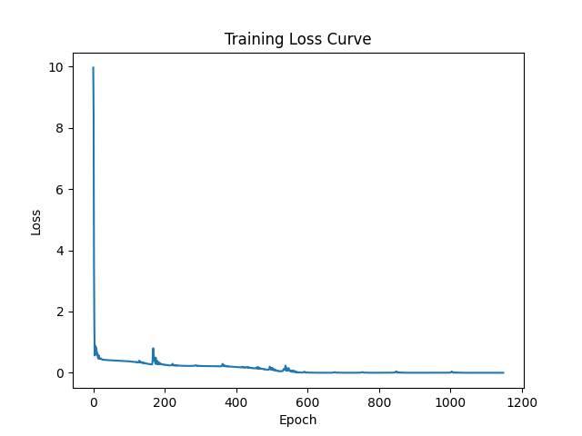

# 深度学习导论_实验一
[TOC] 
PB21081596 胡邃书
## 1. 实验要求
使用pytorch对函数 $y = log_2(x) + cos(\frac{\pi x}{2}), x \in [1, 16]$进行近似，研究数据量、网络深度、学习率、网络宽度、激活函数对模型性能的影响。

## 2. 实验过程

### 2.1 网络框架安装

基础设备： CPU:12400F, GPU:4060ti

安装pytorch的GUDA-12.1版本

### 2.2 数据生成

通过torch自带的库进行数据的随机生成，区间为[1, 16]：
```py
def generate_data(num_samples):
    X = torch.rand(num_samples, 1) * 15 + 1  # 从 [1, 16] 均匀采样
    y = torch.log2(X) + torch.cos(torch.tensor(np.pi) * X / 2)
    return X, y
```
然后用sklearn库自带的，进行数据划分：
```py
def split_dataset(X, y):
    X_train, X_temp, y_train, y_temp = train_test_split(X, y, test_size=0.2, random_state=42)
    X_val, X_test, y_val, y_test = train_test_split(X_temp, y_temp, test_size=0.5, random_state=42)
    return X_train, X_val, X_test, y_train, y_val, y_test
```

### 2.3 模型搭建

经过调参比较，最后得到较好的模型是设置了多层隐藏层，并且使用SiLU进行激活函数，最后曲线更贴合原函数

代码如下：
```py
class FeedforwardNN(nn.Module):
    def __init__(self, input_dim, hidden_dim, output_dim, num_layers):
        super(FeedforwardNN, self).__init__()
        self.fc1 = nn.Linear(input_dim, hidden_dim)
        self.hidden_layers = nn.ModuleList([nn.Linear(hidden_dim, hidden_dim) for _ in range(num_layers)])
        self.fc2 = nn.Linear(hidden_dim, output_dim)

    def forward(self, x):
        out = F.silu(self.fc1(x))  # 使用 SiLU 激活函数
        for layer in self.hidden_layers:
            out = F.silu(layer(out))  
        out = self.fc2(out)
        return out
```

### 2.4 模型训练

设置tolerance为0.0001，低于-5次方的量级可能会导致结果过拟合，从而导致后半曲线拟合结果差，然后运用Adam优化器完成参数更新，它能在不同参数方向上的更新更加平滑，并根据每个参数的梯度情况自动调整学习率

```py
def train_model(model, criterion, optimizer, X_train, y_train):
    losses = []
    loss = 1.0
    epoch = 1
    while loss > 1e-4:
        optimizer.zero_grad()
        outputs = model(X_train)
        loss = criterion(outputs, y_train)
        losses.append(loss)
        loss.backward()
        optimizer.step()
        epoch = epoch + 1
        if epoch % 2000 == 0:
            print(f'Epoch [{epoch}], Loss: {loss.item():.4f}')
        if loss <= 1e-4:
            print(f"Final Epoch:{epoch}, with loss:{loss}")
        if epoch >=20000:
            break
    
    return losses
```

### 2.5 调参分析

经过多次的调参分析，最后得出一个相对较好，并且最终能平均在5000代以内成功收敛的参数，具体分析见模块3：

```py
input_dim = 1
hidden_dim = 64         # 隐藏神经元数
output_dim = 1
num_layers = 5          # 网络深度
learning_rate = 0.01    # 学习率
```

### 2.6 测试 & 可视化

```py
# 定义测试函数
def test_model(model, X_test, y_test):
    with torch.no_grad():               # 关闭torch自动计算导数，加速实验
        y_pred = model(X_test)
        mse = nn.MSELoss()(y_pred, y_test)
        return mse.item()


# 可视化验证集原始样本点和模型预测点
def visualize_results(model, X_val, y_val, n):
    with torch.no_grad():
        y_pred = model(X_val)

    plt.figure(figsize=(8, 6))
    plt.scatter(X_val.cpu().numpy(), y_val.cpu().numpy(), label='Original Data', s=8)
    plt.scatter(X_val.cpu().numpy(), y_pred.cpu().numpy(), color='red', label='Predicted Data', s=8)
    plt.xlabel('x')
    plt.ylabel('y')
    plt.title(f'Validation Set: Original vs. Predicted with N={n}')
    plt.legend()
    plt.show()
```

## 3. 超参数 & 测试集分析 

### 3.1 网络深度

网络深度，即代码中定义num_layers的参数。

以N=2000, learning_rate = 0.01，hidden_dim = 64，tolerance = $10^{-4}$，迭代次数上限为30000作为测试的基准

1. num_layers = 1
    我们先来看网络深度为1的情况，即只有一层隐藏层(表格呈现每次收敛代数)：

    | Train-1 | Test-1 | Train-2 | Test-2 | Train-3 | Test-3 | Train-4 | Test-4 | 平均值 | 
    |-----|-----|-----|-----|-----|-----|-----|-----|-----|
    | 13607 | 19082 | 24060 | 27053 | 19059 | 16214 | 20277 | 20484 | 19979.5 |

    平均迭代数在19979.5，虽然每次迭代次数不尽相同，但对于同一模型，训练集与测试集收敛代数都相近，但是收敛代数小的(例如13607)，losses函数振荡较大，而收敛代数大的(20277)就较好，对比图如下：

    13607:
    

    20277:
    


2. num_layers = 4

    表格：
    | Train-1 | Test-1 | Train-2 | Test-2 | Train-3 | Test-3 | Train-4 | Test-4 | 平均值 | 
    |-----|-----|-----|-----|-----|-----|-----|-----|-----|
    | 1666 | 2332 | 1653 | 1398 | 2132 | 4044 | 4277 | 4391 | 2736.625 |

    在5000代以内就可以得到收敛，并且结果较好，运行时间短。

    收敛图如下：
    

3. num_layers = 10
    再往上叠加层数后，每一代运行时间成本大大增加，且收敛代数大大增加，loss振荡大，放一个运行图如下：
    也尝试过改变学习率，调高后反而不收敛，产生**过拟合现象**，因此没有继续练。
    


### 3.2 学习率

样本量对于学习率的影响很大，所以我选择以hidden_dim = 64，tolerance = $10^{-4}$，num_layers = 4，迭代次数上限为30000作为测试的基准

#### 3.2.0 N = 200

1. learning_rate = 0.001

    结果较好，迭代次数较多：

    Final Epoch:15029, with loss:9.863691229838878e-05
    
    Final Test MSE: 0.0003

    loss图：
    

2. learning_rate = 0.01

    结果较好，迭代次数少：

    Final Epoch:4390, with loss:9.657665941631421e-05

    Final Test MSE: 0.0001

    loss图：
    

3. learning_rate = 0.1

    结果较好，迭代次数少：

    Final Epoch:5479, with loss:9.996473090723157e-05

    Final Test MSE: 0.0002

    loss图：
    

对于N = 200的情况下学习率区别不大，收敛程度都较好，可能是hidden_dim与num_layers调的较好缘故

#### 3.2.1 N = 2000

1. learning_rate = 0.001

    结果较好，迭代次数较多：

    Final Epoch:12181, with loss:9.99175535980612e-05
    
    Final Test MSE: 0.0001

    loss图：
    

2. learning_rate = 0.01

    结果较好，迭代次数少，收敛快：

    Final Epoch:1150, with loss:9.950606181519106e-05

    Final Test MSE: 0.0001

    loss图：
    

3. learning_rate = 0.1

    学习率过高，模型参数在每次更新时会跳跃式地更新，导致跳过最优解附近的局部极小值点。
    
    无法收敛到最优解，在损失函数空间中来回振荡。

    Epoch [2000], Loss: 0.2898
    Epoch [4000], Loss: 1.8523
    Epoch [6000], Loss: 3.2029
    Epoch [8000], Loss: 1.5381
    Epoch [10000], Loss: 1.6089
    Epoch [12000], Loss: 1.5810
    Epoch [14000], Loss: 1.6284
    Epoch [16000], Loss: 1.6298
    Epoch [18000], Loss: 1.6882
    Epoch [20000], Loss: 1.6732
    Epoch [22000], Loss: 1.7639
    Epoch [24000], Loss: 1.7639
    Epoch [26000], Loss: 1.7639
    Epoch [28000], Loss: 1.7639
    Epoch [30000], Loss: 1.7639
    Final Test MSE: 1.6037

#### 3.2.2 N = 10000

1. learning_rate = 0.001

    结果较好，迭代次数较多：

    Final Epoch:7042, with loss:9.992613195208833e-05

    Final Test MSE: 0.0001

    loss图：
    

2. learning_rate = 0.01

    结果较好，迭代次数少，收敛快：

    Final Epoch:4264, with loss:8.824809629004449e-05

    Final Test MSE: 0.0001

    loss图：
    

3. learning_rate = 0.1

    同样是学习率过高，不收敛，结果不再展示


### 3.3 网络宽度

即每一层的神经元数，代码中变量为hidden_dim

根据上述实验，以learning_rate = 0.01，tolerance = $10^{-4}$，num_layers = 4，迭代次数上限为30000作为测试的基准，分别对hidden_dim = 32、64、128测试

1. hidden_dim = 32

    很奇怪，训练验证的时候不收敛，但是同样的模型测试集收敛了：
    

    再训练一次尝试，不收敛了。猜测原因：
    
    1. **数据分布不均匀**： 在划分训练集、验证集和测试集时，可能由于数据分布的不均匀导致了这种情况。例如，可能训练集中的样本分布和验证集中的样本分布存在差异，导致模型在验证集上的表现不佳。而测试集表现正常可能是由于测试集与验证集数据分布更接近。

    2. **过拟合**： 当网络宽度较小时，模型的容量可能不足以学习到数据的复杂特征，导致模型在验证集上的性能较差。而在测试集上表现良好可能是由于模型在测试集上具有较好的泛化能力，能够泛化到未见过的数据。

    3. **随机性**： 训练神经网络具有一定的随机性，包括初始参数的随机初始化和数据的随机采样等。这种随机性可能导致不同的训练过程产生不同的结果，即使使用相同的模型和数据。因此，可能出现验证集不收敛而测试集收敛的情况。


2. hidden_dim = 64

    与**3.2.1**的第二部分重合，不再赘述

3. hidden_dim = 128

    结果**不收敛**，网络宽度过大时，模型的参数量增加，如果训练数据量不够大，模型可能会过度拟合训练数据，即学习到了训练数据中的噪声和特定的样本特征，而无法泛化到未见过的数据。这会导致模型在验证集上的性能较差，甚至无法收敛。

    因此选择再尝试一下N = 10000的情况表现如何：

    结局依然不收敛，并且拟合图像呈现一条跨越整个数据集的直线，分析原因如下：

    1. **梯度消失或梯度爆炸**： 在深度较大的神经网络中，梯度可能会出现消失或爆炸的情况。当网络宽度过大时，参数数量增加，导致梯度在反向传播过程中传递时变得更加不稳定。这可能会导致梯度消失或爆炸，使得模型无法有效地更新参数，从而无法收敛。

    2. **优化困难**： 在网络宽度过大时，模型的优化过程可能会变得更加困难。由于参数数量增加，优化问题变得更加复杂，优化算法可能会陷入局部最优解或者优化过程变得不稳定，导致模型无法收敛。


### 3.4 整体总结

根据这几天整体的调参（炼丹）的结果来看，使用SiLU激活函数的拟合结果要整体上优于ReLU的结果，曲线更加平滑，而Adam的优化器远强于SDG，随机梯度并不适用于函数的拟合

然后是关于tolerance的设置，我个人的参数设置下，很难收敛到1e-5的loss，而1e-4在5000次内的迭代下基本都能达到，而1e-3基本在1000代以内就能收敛。

最后贴一下N = 200、2000、10000时验证集原始样本点和预测点可视化图

tolerance一样的情况下大多数优良拟合的情况都差不多，MSE基本就在区间 [0.0001, 0.0004]内：


