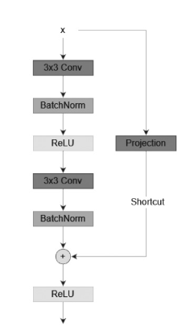
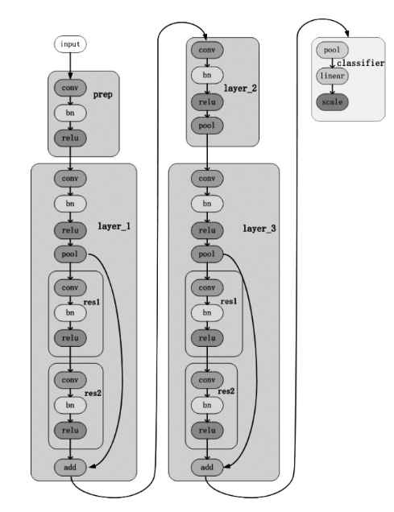
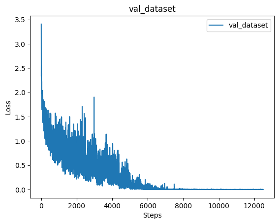
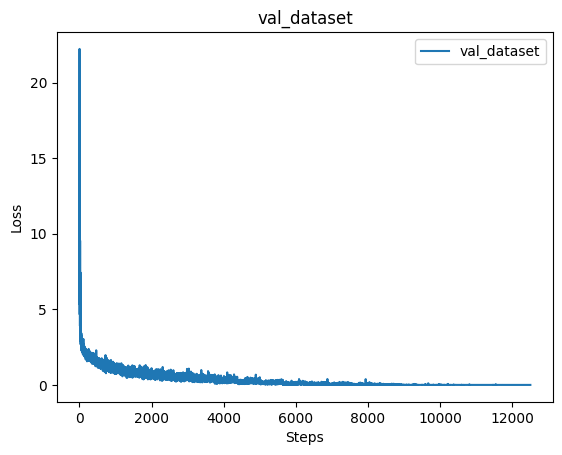

# 深度学习导论_实验二
[TOC] 
PB21081596 胡邃书

## 1. 实验要求
使用pytorch 或者tensorflow 实现卷积神经网络CNN，在CIFAR-10 数据集上进行图片分类。研究dropout、normalization、learning rate decay 等模型训练技巧，以及卷积核大小、网络深度等超参数对分类性能的影响。

## 2. 实验原理

### 2.1 ResNet

本实验采用CNN经典模型：深度残差网络ResNet。

参考论文：https://d.wanfangdata.com.cn/periodical/ChlQZXJpb2RpY2FsQ0hJTmV3UzIwMjMxMjI2Eg94eGpsY2wyMDIzMDMwMzUaCDQzczNxaWxw

残差神经网络的出现有效地缓解了由于网络深度增加带来的梯度消失和网络退化问题，能够使神经网络的训练速度加快，并且可以大幅提升深度网络的泛化能力和鲁棒性。

### 2.2 残差块
ResNet 将层训练为残差函数，以克服退化问题。退化问题是当层数变得非常大时，深度神经网络的精度开始下降。

将神经网络的输入记为 $x$，假设科研人员希望通过学习获得的潜在函数是 $f(x)$。在图 1 的左侧，虚线框内的部分必须直接学习函数 $f(x)$。如果恒等函数 $f(x)=x$是要学习的潜在函数，那么使用残差函数则更容易学习：科研人员只需要将虚线框中靠上面的权重层的权重和偏置设置为零。ResNet 的残差块，将层输入 $x$ 连接到加法运算符的实线称为残差连接（也称为快捷方式连接）。通过残差块，输入可以通过层间的残差连接更快地向前传播。

本文使用不带瓶颈的残差块，图如下(**详情见代码**)：



### 2.3 ResNet-9结构

ResNet-9基本如下(**详情见代码**)：


所有卷积层使用的卷积核的大小都是 3，padding 为 1。在 prep 层里，卷积操作的输入通道数是 3，输出通道数是 64，因此输出图片的大小仍然是 32×32。在 layer_1 层 里， 首 先 经 过 了 一 个 输 入 通 道 数 是64，输出通道数是 128 的卷积层；然后经过一个 2×2的最大池化层，将图片尺寸减小为 16×16；最后经过一个残差块，该残差块包含两个输入和输出通道数都是128 的卷积层。图 2 ResNet-9 模型结构在 layer_2 层里，首先经过了一个输入通道数是 128，输出通道数是 256 的卷积层，最后经过一个 2×2 的最大池化层，将图片尺寸减小为 8×8。在 layer_3 层里，首先经过了一个输入通道数是 256，输出通道数是 512 的卷积层；然后经过一个 2×2 的最大池化层，将图片尺寸减小为 4×4；最后经过一个残差连接块，该残差块包含两个输入和输出通道数都是 512 卷积层。在 classifier 层里，首先经过了一个 4×4 的最大池化层，将图片尺寸减小为 1×1；然后经过一个全连接（输入为 512，输出为 10），最后使用 softmax 将输出转化为概率（输出值的和为 1）。由于模型中有 8 个卷积层和 1 个全连接层，因此称为 ResNet-9。

## 3. 实验过程

### 3.1 网络框架安装

基础设备： CPU:12400F, GPU:4060ti

pytorch版本：

    Pytorch version:2.2.1+cu121
    torchvision version:0.17.1+cu121

### 3.2 数据预处理

首先定义transform方式，转换成张量，并且对数据集归一化处理
然后加载数据集，将dataset以4:1的方式划分成训练集和验证集

```py
# 数据预处理
transform = transforms.Compose([
    transforms.ToTensor(), # 转换为张量
    transforms.Normalize((0.5, 0.5, 0.5), (0.5, 0.5, 0.5)) # 归一化
])

# 加载 CIFAR-10 数据集
dataset = torchvision.datasets.CIFAR10(root='./data', train=True, download=False, transform=transform)
test_dataset = torchvision.datasets.CIFAR10(root='./data', train=False, download=False, transform=transform)

train_size = int(0.8 * len(dataset))
val_size = len(dataset) - train_size
train_dataset, val_dataset = random_split(dataset, [train_size, val_size])
```

### 3.3 模型搭建

**注：代码过长，详情见ipynb文件**

### 3.4 模型训练

在模型训练方面采用了余弦warmup衰减，实现如下：

```py
def get_cosine_schedule_with_warmup(
    learning_rate, num_warmup_steps: int, num_training_steps: int, num_cycles: float = 0.5, last_epoch: int = -1
):
    def lr_lambda(current_step):
        if current_step < num_warmup_steps:
            lr = float(current_step) / (float(max(1, num_warmup_steps)))
            lr = lr + 0.01
            return lr
        progress = float(current_step - num_warmup_steps) / float(max(1, num_training_steps - num_warmup_steps))
        return max(0.0, 0.5 * (1.0 + math.cos(math.pi * float(num_cycles) * 2.0 * progress)))

    lrs = []
    for current_step in range(num_training_steps):
        cur_lr = lr_lambda(current_step) * learning_rate
        lrs.append(cur_lr)
    return lrs
```

该方式训练效果对于效率方面有较大的提升，但是20代以内对正确率提升不大，结果对比如下

| 未使用余弦warmup衰减 | 使用余弦warmup衰减 |
|----------------------|---------------------|
| Epoch 1, Train Loss: 2.12324610080719   | Epoch 1, Train Loss: 1.3214236289024353  |
| Epoch 1, Validation Loss: 1.385981657702452, Validation Accuracy: 49.60%   | Epoch 1, Validation Loss: 0.9558250429523978, Validation Accuracy: 66.29%  |
| Epoch 2, Train Loss: 1.116080178642273   | Epoch 2, Train Loss: 0.887731547164917  |
| Epoch 2, Validation Loss: 1.0238996349322569, Validation Accuracy: 64.64%   | Epoch 2, Validation Loss: 1.105503118721543, Validation Accuracy: 66.05%  |
| Epoch 3, Train Loss: 0.8150630704402924   | Epoch 3, Train Loss: 0.7370531705379486  |
| Epoch 3, Validation Loss: 0.7095644267121698, Validation Accuracy: 76.05%   | Epoch 3, Validation Loss: 0.8361479057248231, Validation Accuracy: 73.11%  |
| Epoch 4, Train Loss: 0.6300490198612213   | Epoch 4, Train Loss: 0.6406749064683914  |
| Epoch 4, Validation Loss: 0.6902414324936593, Validation Accuracy: 77.12%   | Epoch 4, Validation Loss: 0.7499364111453865, Validation Accuracy: 77.46%  |
| Epoch 5, Train Loss: 0.4997096820354462   | Epoch 5, Train Loss: 0.5355829450130463  |
| Epoch 5, Validation Loss: 0.6035177303347617, Validation Accuracy: 80.55%   | Epoch 5, Validation Loss: 0.6950123427779811, Validation Accuracy: 79.87%  |
| Epoch 6, Train Loss: 0.39862745316028597  | Epoch 6, Train Loss: 0.44073048437833784 |
| Epoch 6, Validation Loss: 0.5368855227330688, Validation Accuracy: 82.51%   | Epoch 6, Validation Loss: 0.7672391820959984, Validation Accuracy: 79.00%  |
| Epoch 7, Train Loss: 0.29947636177539827  | Epoch 7, Train Loss: 0.3342051611423492  |
| Epoch 7, Validation Loss: 0.5496619929363773, Validation Accuracy: 82.67%   | Epoch 7, Validation Loss: 0.9763136384593454, Validation Accuracy: 77.32%  |
| Epoch 8, Train Loss: 0.2114972721338272   | Epoch 8, Train Loss: 0.17168190983980894 |
| Epoch 8, Validation Loss: 0.5866764286521134, Validation Accuracy: 83.27%   | Epoch 8, Validation Loss: 0.6099798806533692, Validation Accuracy: 84.11%  |
| Epoch 9, Train Loss: 0.13964306252002717  | Epoch 9, Train Loss: 0.06994249974563718 |
| Epoch 9, Validation Loss: 0.6181381601057235, Validation Accuracy: 82.94%   | Epoch 9, Validation Loss: 0.6009700520403066, Validation Accuracy: 85.52%  |
| Epoch 10, Train Loss: 0.09083863134533167 | Epoch 10, Train Loss: 0.02653209688179195 |
| Epoch 10, Validation Loss: 0.5965916298946757, Validation Accuracy: 84.27%  | Epoch 10, Validation Loss: 0.5643618455168548, Validation Accuracy: 86.85% |
| Epoch 11, Train Loss: 0.05570536591336131 | Epoch 11, Train Loss: 0.00889298256249167 |
| Epoch 11, Validation Loss: 0.5889805125392926, Validation Accuracy: 84.87% | Epoch 11, Validation Loss: 0.5616482273811937, Validation Accuracy: 86.85% |
| Epoch 12, Train Loss: 0.040948852559179065 | Epoch 12, Train Loss: 0.0031730160122737288 |
| Epoch 12, Validation Loss: 0.573368114081158, Validation Accuracy: 85.79% | Epoch 12, Validation Loss: 0.6115297899836567, Validation Accuracy: 86.82% |
| Epoch 13, Train Loss: 0.02532699820958078 | Epoch 13, Train Loss: 0.0014616468094522134 |
| Epoch 13, Validation Loss: 0.5787334029272104, Validation Accuracy: 85.90% | Epoch 13, Validation Loss: 0.5218927403378069, Validation Accuracy: 88.00% |
| Epoch 14, Train Loss: 0.012969463099446148 | Epoch 14, Train Loss: 0.0007479552371194586 |
| Epoch 14, Validation Loss: 0.5692345666088117, Validation Accuracy: 86.33% | Epoch 14, Validation Loss: 0.5148199864182692, Validation Accuracy: 88.09% |
| Epoch 15, Train Loss: 0.004024994133086875 | Epoch 15, Train Loss: 0.0005750115177594125 |
| Epoch 15, Validation Loss: 0.5547000022640654, Validation Accuracy: 87.17% | Epoch 15, Validation Loss: 0.5155020593161321, Validation Accuracy: 88.27% |
| Epoch 16, Train Loss: 0.002116853754175827 | Epoch 16, Train Loss: 0.000535221000702586 |
| Epoch 16, Validation Loss: 0.5508448965610213, Validation Accuracy: 87.67% | Epoch 16, Validation Loss: 0.5152791155988623, Validation Accuracy: 88.11% |
| Epoch 17, Train Loss: 0.0015913950839778407 | Epoch 17, Train Loss: 0.0005073012579930946 |
| Epoch 17, Validation Loss: 0.5374747325375582, Validation Accuracy: 87.85% | Epoch 17, Validation Loss: 0.5135037711091862, Validation Accuracy: 88.11% |
| Epoch 18, Train Loss: 0.0007807901933789254 | Epoch 18, Train Loss: 0.0004849977507838048 |
| Epoch 18, Validation Loss: 0.5380335931850088, Validation Accuracy: 87.96% | Epoch 18, Validation Loss: 0.5157053291584086, Validation Accuracy: 88.04% |
| Epoch 19, Train Loss: 0.0006640050267684274 | Epoch 19, Train Loss: 0.0004646534419967793 |
| Epoch 19, Validation Loss: 0.5438457404257385, Validation Accuracy: 87.88% | Epoch 19, Validation Loss: 0.5197366115868471, Validation Accuracy: 88.19% |
| Epoch 20, Train Loss: 0.00043959300050046296 | Epoch 20, Train Loss: 0.00048724322516936807 |
| Epoch 20, Validation Loss: 0.5462056833562577, Validation Accuracy: 88.18% | Epoch 20, Validation Loss: 0.5180412177945588, Validation Accuracy: 88.19% |

可以看到余弦warmup学习率衰减技术对于加速收敛，提高效率，降低成本方面有较强的效果，但是对准确率提升并没有那么大。

同时使用余弦warmup学习率衰减技术对于验证集的损失，会造成较大的振荡，对比如下：

| 使用 | 不使用 |
| --- | --- |
|  |  |

### 3.5 测试结果

最后测试结果：

Test Loss: 0.5552501050862158, Test Accuracy: 87.64%


### 3.6 其他调参心得

一开始使用的是最基础的CNN，调用了三层的卷积神经网络，每一层后进行池化，然后无论如何调参，做了多层的改变，学习率一直在65-75之间徘徊，很难突破80的准确率，然后查阅了一下论文，了解了更多的模型技巧，选取了深度残差网络的技术，在五代内就能达到80以上的准确率，收敛在88准确率。